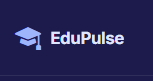
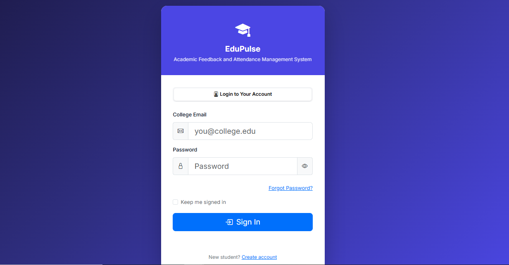
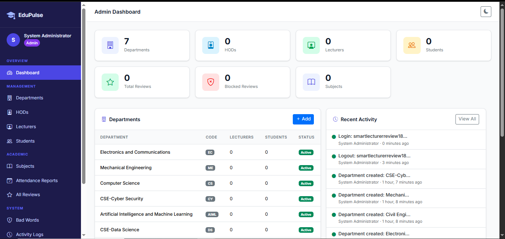
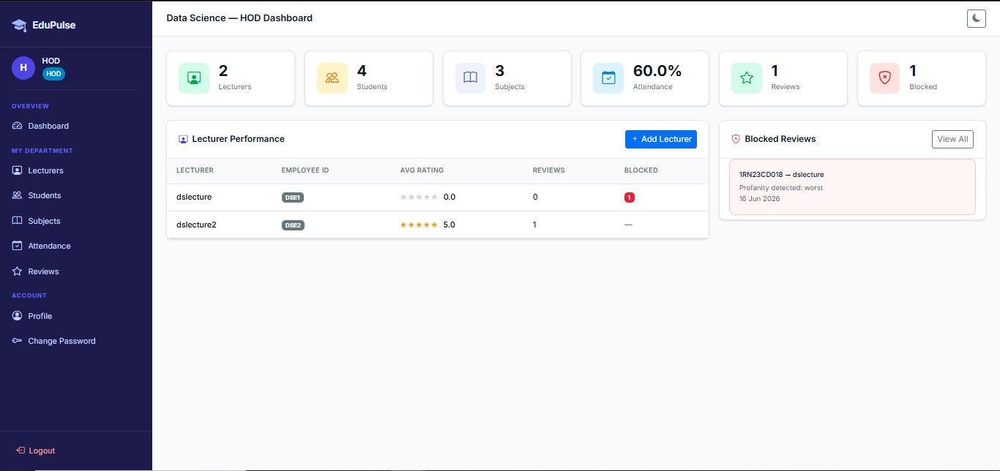
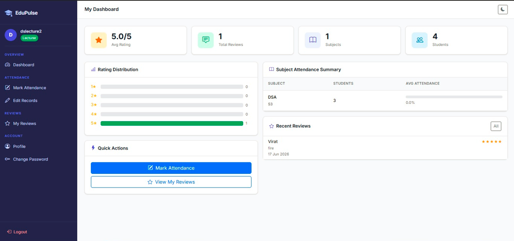
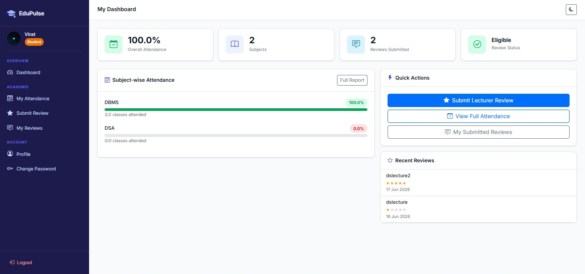

# EduPulse : Academic Feedback and Attendance Management System

<p align="center">
  
</p>

<p align="center">
  <strong>A role-based academic management platform for attendance tracking, lecturer feedback, review moderation, and institutional analytics.</strong>
</p>

<p align="center">
  
  
  
  
  
</p>

---

## 🌐 Live Demo

**Live Application:** https://edupulse-984z.onrender.com

**GitHub Repository:** https://github.com/Kirankumar-K18/edupulse

---

## 📖 Overview

EduPulse is a comprehensive Academic Feedback and Attendance Management System developed to streamline academic administration, lecturer evaluation, attendance monitoring, and institutional analytics.

The platform provides dedicated dashboards for Administrators, Heads of Department (HODs), Lecturers, and Students. It integrates attendance management, lecturer feedback, review moderation, performance analytics, secure authentication, and cloud deployment into a single unified solution.

---

## ✨ Key Features

### 🔐 Authentication & Security

* Custom Django User Model
* Role-Based Access Control (RBAC)
* Secure Login & Logout
* Password Change Functionality
* Forgot Password via Brevo Email API
* Secure Password Reset Workflow
* Activity Logging
* CSRF Protection
* Password Hashing (PBKDF2)

### 📊 Attendance Management

* Subject-Based Attendance Tracking
* Attendance Marking and Editing
* Attendance History Management
* Subject-Wise Attendance Reports
* Overall Attendance Percentage Calculation
* Attendance Eligibility Validation
* Duplicate Attendance Prevention

### ⭐ Lecturer Feedback System

* Lecturer Rating System (1–5 Stars)
* Student Feedback Submission
* Attendance-Based Review Eligibility
* Review Moderation
* Bad Word Detection and Filtering
* Blocked Review Management
* Review History Tracking
* One Review Per Lecturer Per Semester

### 📈 Analytics Dashboard

* Attendance Analytics
* Lecturer Performance Monitoring
* Department Statistics
* Review Analytics
* Administrative Insights
* Activity Monitoring

---

## 👥 User Roles

| Role     | Responsibilities                                                                |
| -------- | ------------------------------------------------------------------------------- |
| Admin    | Manage Departments, HODs, Lecturers, Students, Subjects, Analytics & Moderation |
| HOD      | Department Management, Lecturer Monitoring, Attendance Analytics                |
| Lecturer | Attendance Management, Student Monitoring, Review Tracking                      |
| Student  | Attendance Tracking, Feedback Submission, Review History                        |

---

## 🛠️ Technology Stack

| Category        | Technology               |
| --------------- | ------------------------ |
| Backend         | Django 4.2               |
| Language        | Python 3.11              |
| Database        | PostgreSQL               |
| Frontend        | HTML5, CSS3, JavaScript  |
| UI Framework    | Bootstrap 5              |
| Authentication  | Custom Django User Model |
| ORM             | Django ORM               |
| Email Service   | Brevo API                |
| Deployment      | Render                   |
| Web Server      | Gunicorn                 |
| Static Files    | WhiteNoise               |
| Version Control | Git & GitHub             |

---

## 📸 Application Screenshots

### Login Page



### Admin Dashboard



### HOD Dashboard



### Lecturer Dashboard



### Student Dashboard



---

## 📂 Project Structure

```text
EduPulse/
│
├── backend/
│   ├── apps/
│   │   ├── accounts/      # Authentication & User Management
│   │   ├── attendance/    # Attendance Management
│   │   ├── reviews/       # Lecturer Reviews & Ratings
│   │   └── dashboard/     # Role-Based Dashboards
│   │
│   ├── manage.py
│   ├── requirements.txt
│   └── smart_lecturer/
│       ├── settings.py
│       ├── urls.py
│       ├── wsgi.py
│       └── asgi.py
│
├── frontend/
│   ├── static/
│   └── templates/
│
├── docs/
│   └── screenshots/
│
├── README.md
└── .gitignore
```

---

## 🚀 Key Highlights

* Custom Django User Model
* Role-Based Academic Management System
* Attendance Tracking & Analytics
* Lecturer Review & Rating Platform
* Review Moderation & Content Filtering
* Secure Password Recovery via Brevo API
* PostgreSQL Cloud Database Integration
* Production Deployment on Render
* Responsive User Interface

---

## ⚙️ Local Installation

### Clone Repository

```bash
git clone https://github.com/Kirankumar-K18/edupulse.git

cd edupulse
```

### Create Virtual Environment

#### Windows

```bash
python -m venv .venv

.venv\Scripts\activate
```

#### Linux / macOS

```bash
python3 -m venv .venv

source .venv/bin/activate
```

### Install Dependencies

```bash
pip install -r backend/requirements.txt
```

### Configure Environment Variables

Create a `.env` file:

```env
DJANGO_SECRET_KEY=your-secret-key

DEBUG=True

ALLOWED_HOSTS=localhost,127.0.0.1

DB_NAME=database_name
DB_USER=database_user
DB_PASSWORD=database_password
DB_HOST=localhost
DB_PORT=5432

BREVO_API_KEY=your_brevo_api_key
```

### Apply Migrations

```bash
cd backend

python manage.py migrate
```

### Create Superuser

```bash
python manage.py createsuperuser
```

### Run Development Server

```bash
python manage.py runserver
```

Open:

```text
http://127.0.0.1:8000/
```

---

## 🔒 Security Features

* Django CSRF Protection
* Password Hashing (PBKDF2)
* Role-Based Access Control
* Department-Level Data Isolation
* Session Authentication
* ORM-Based SQL Injection Protection
* Activity Logging
* Review Moderation
* Secure Password Recovery

---

## ☁️ Deployment

EduPulse is deployed on Render using:

* Django 4.2
* PostgreSQL Database
* Gunicorn
* WhiteNoise
* Brevo Email API

Production deployment includes:

* Cloud Database Integration
* Secure Authentication
* Password Recovery System
* Static Asset Hosting
* Environment Variable Management

---

## 🔮 Future Enhancements

* AI-Based Feedback Sentiment Analysis
* Lecturer Performance Prediction
* PDF Report Generation
* Excel Export Functionality
* Mobile Application Support
* Real-Time Notifications
* Advanced Analytics Dashboard

---

## 👨‍💻 Author

**Kirankumar K**

Computer Science & Data Science Engineering

RNS Institute of Technology

GitHub: https://github.com/Kirankumar-K18

Repository: https://github.com/Kirankumar-K18/edupulse

Live Demo: https://edupulse-984z.onrender.com

---

## 📄 License

This project is developed for educational and academic purposes.

